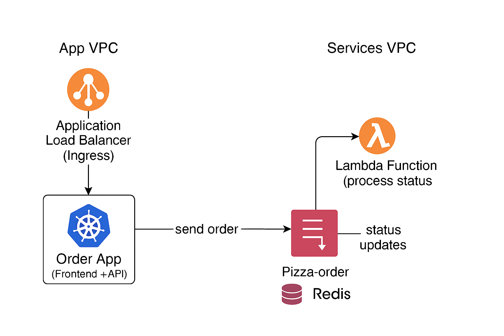

# aws_pizza_demo
Aws Demo that touches most areas of Devops Develpment
# 🍕 Pizza Order System – CI/CD Demo Project

This repository demonstrates my **DevOps, Cloud, and CI/CD skills** using a fun "Pizza Ordering System" scenario.  
It showcases **Terraform for AWS infrastructure**, **GitLab CI/CD for automation**, and **Kubernetes (EKS)** for application deployment.  

---

## 🚀 Project Overview
## add png for a simple diagram of the pizza-demo


1. **Pizza Order App (App1)** – exposed via ALB  
   - React + FastAPI app.  
   - Users place pizza orders → messages pushed to AWS **SQS (`pizza-orders`)**.  
   - Has a "Status" button → queries the **DB** directly.  
   - Displays a donut chart of order progress.

2. **Database (DB Container)**  
   - Postgres/Redis running in the App VPC (EKS).  
   - Stores the current status of each order.  
   - Queried directly by App1, updated directly by Lambda.

3. **Lambda Function**  
   - Triggered by `pizza-orders` SQS queue.  
   - Simulates pizza preparation stages:  
     - Order received  
     - Pizza cooking  
     - Pizza preparing  
     - Ready for collection  
   - Updates the DB with the latest status for each order.

4. **Networking**  
   - Only **App1** is exposed externally via ALB.  
   - App1 queries the DB directly.  
   - Lambda (in Services VPC) writes to the DB (in App VPC) via **VPC peering**.  


---

## 🏗️ Architecture Diagram

```mermaid
flowchart LR
    subgraph AppVPC["App VPC (EKS Cluster)"]
        ALB["Application Load Balancer (Ingress)"]
        A1["🍕 Order App (Frontend"]
        DB["🗄️ DB (Redis in container)"]

        ALB --> A1
        A1 -->|query status| DB
    end

    subgraph ServicesVPC["Services VPC (Lambda + SQS)"]
        SQS1["📥 SQS Queue: pizza-orders"]
        LAMBDA["⚡ Lambda Function (process order)"]

        SQS1 -->|trigger| LAMBDA
        LAMBDA -->|write status| DB
    end

    A1 -->|send order| SQS1
    A1 -->|reads status| DB
    AppVPC <-. VPC Peering .-> ServicesVPC


