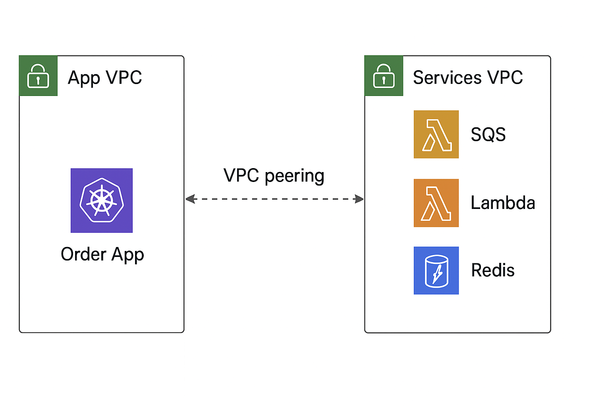
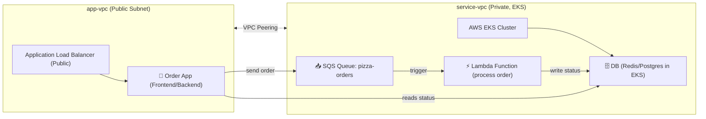

# aws_pizza_demo
Aws Demo that touches most areas of DevOps Development

# 🍕 Pizza Order System – CI/CD Demo Project

This repository demonstrates my **DevOps, Cloud, and CI/CD skills** using a fun "Pizza Ordering System" scenario.  
It showcases **Terraform for AWS infrastructure**, **GitLab CI/CD for automation**, and **Kubernetes (EKS)** for application deployment.  

---

## 🚀 Project Overview

### 🗺️ Updated Architecture

- **app-vpc**  
  - Contains the **Application Load Balancer (ALB)** in a **public subnet**.  
  - Hosts the Pizza Order App (frontend/backend).  
  - ALB exposes the app to the internet.

- **service-vpc**  
  - A **private VPC** running **AWS EKS** (Kubernetes).  
  - Hosts backend services, Lambda functions, and SQS.  
  - Not directly accessible from the internet.

- **Networking**  
  - VPC peering connects `app-vpc` and `service-vpc`.  
  - Only the ALB in `app-vpc` is public; all other resources are private.

---

## 🏗️ Architecture Diagram

```mermaid
flowchart LR
    subgraph AppVPC["app-vpc (Public Subnet)"]
        ALB["Application Load Balancer (Public)"]
        A1["🍕 Order App (Frontend/Backend)"]
        ALB --> A1
    end

    subgraph ServiceVPC["service-vpc (Private, EKS)"]
        EKS["AWS EKS Cluster"]
        SQS1["📥 SQS Queue: pizza-orders"]
        LAMBDA["⚡ Lambda Function (process order)"]
        DB["🗄️ DB (Redis/Postgres in EKS)"]

        EKS --> DB
        SQS1 -->|trigger| LAMBDA
        LAMBDA -->|write status| DB
    end

    A1 -->|send order| SQS1
    A1 -->|reads status| DB
    AppVPC <-. VPC Peering .-> ServiceVPC
```

---

## 📦 Components

1. **Pizza Order App (App1)** – exposed via ALB in `app-vpc`  
   - React + FastAPI app.  
   - Users place pizza orders → messages pushed to AWS **SQS (`pizza-orders`)**.  
   - "Status" button queries the DB directly.  
   - Displays a donut chart of order progress.

2. **Database (DB Container)**  
   - Postgres/Redis running in the EKS cluster (`service-vpc`).  
   - Stores the current status of each order.  
   - Queried directly by App1, updated by Lambda.

3. **Lambda Function**  
   - Triggered by `pizza-orders` SQS queue.  
   - Simulates pizza preparation stages.  
   - Updates the DB with the latest status for each order.

---

## ⚡ Key Points

- **ALB** is public and lives in `app-vpc`.
- **EKS** and backend services are private in `service-vpc`.
- **VPC peering** enables secure communication between app

