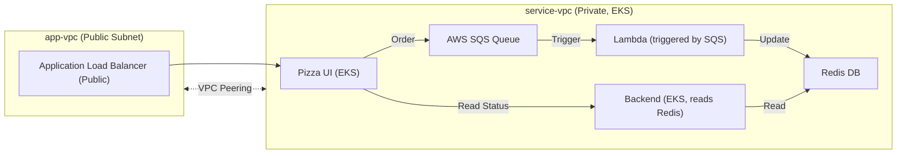

# aws_pizza_demo
Aws Demo that touches most areas of DevOps Development

# 🍕 Pizza Order System – CI/CD Demo Project

This repository demonstrates my **DevOps, Cloud, and CI/CD skills** using a fun "Pizza Ordering System" scenario.  
It showcases **Terraform for AWS infrastructure**, **GitLab CI/CD for automation**, and **Kubernetes (EKS)** for application deployment.  

---

## 🚀 Project Overview

### 🗺️ Updated Architecture

- **app-vpc**  
  - Contains only the **Application Load Balancer (ALB)** in a **public subnet**.  
  - The ALB is public and connects to the backend services in `service-vpc` via VPC peering.

- **service-vpc**  
  - A **private VPC** running **AWS EKS** (Kubernetes).  
  - EKS hosts the Pizza UI (frontend) and backend service (reads Redis DB).
  - Redis DB is updated by a Lambda function triggered by AWS SQS.
  - The Pizza UI places orders onto SQS.

- **Networking**  
  - VPC peering connects `app-vpc` and `service-vpc`.
  - Only the ALB in `app-vpc` is public; all other resources are private.

---

## 🏗️ Architecture Diagram

```mermaid
flowchart LR
    subgraph AppVPC["app-vpc (Public Subnet)"]
        ALB["Application Load Balancer (Public)"]
    end

    subgraph ServiceVPC["service-vpc (Private, EKS)"]
        UI["Pizza UI (EKS)"]
        BE["Backend (EKS, reads Redis)"]
        REDIS["Redis DB"]
        SQS["AWS SQS Queue"]
        LAMBDA["Lambda (triggered by SQS)"]

        UI -->|Order| SQS
        SQS -->|Trigger| LAMBDA
        LAMBDA -->|Update| REDIS
        UI -->|Read Status| BE
        BE -->|Read| REDIS
    end

    ALB --> UI
    AppVPC <-. VPC Peering .-> ServiceVPC
```

---

## 📦 Components

1. **Application Load Balancer (ALB)** – public, in `app-vpc`  
   - Routes traffic to the Pizza UI running in EKS (`service-vpc`).

2. **Pizza UI (EKS)**  
   - Users place pizza orders via the UI.
   - UI places orders onto AWS SQS.

3. **Backend (EKS)**  
   - Reads order status from Redis DB.

4. **Redis Database**  
   - Stores the current status of each order.
   - Updated by Lambda.

5. **Lambda Function**  
   - Triggered by SQS queue.
   - Processes orders and updates Redis DB.

---

## ⚡ Key Points

- **ALB** is public and lives in `app-vpc`.
- **EKS**, backend, Redis, Lambda, and SQS are private in `service-vpc`.
- **VPC peering** enables secure communication between ALB and backend services.

